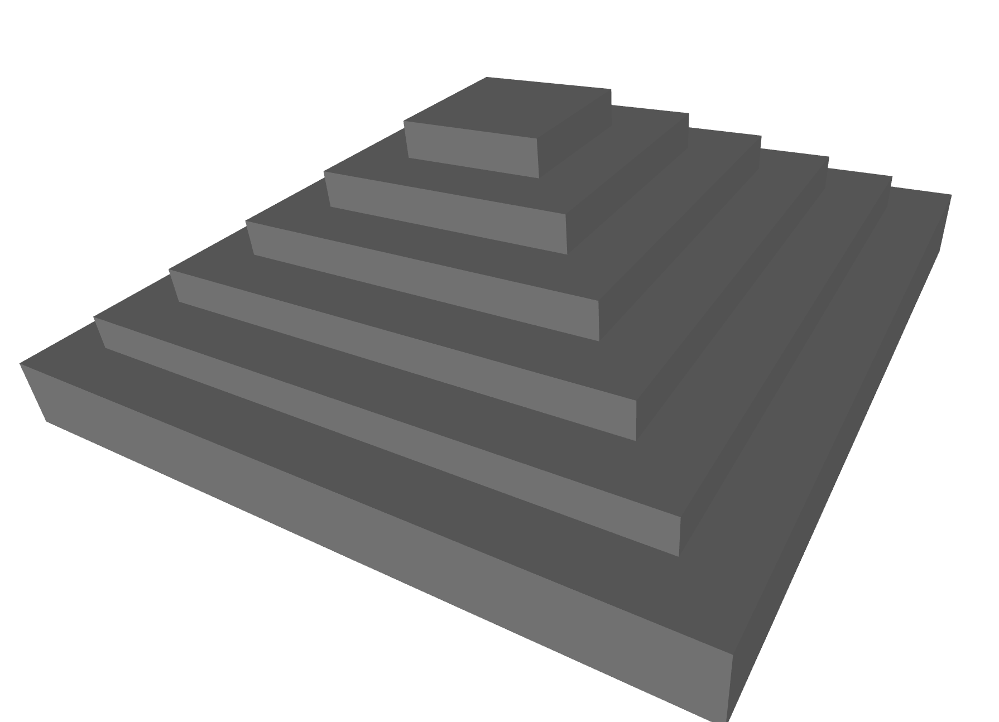
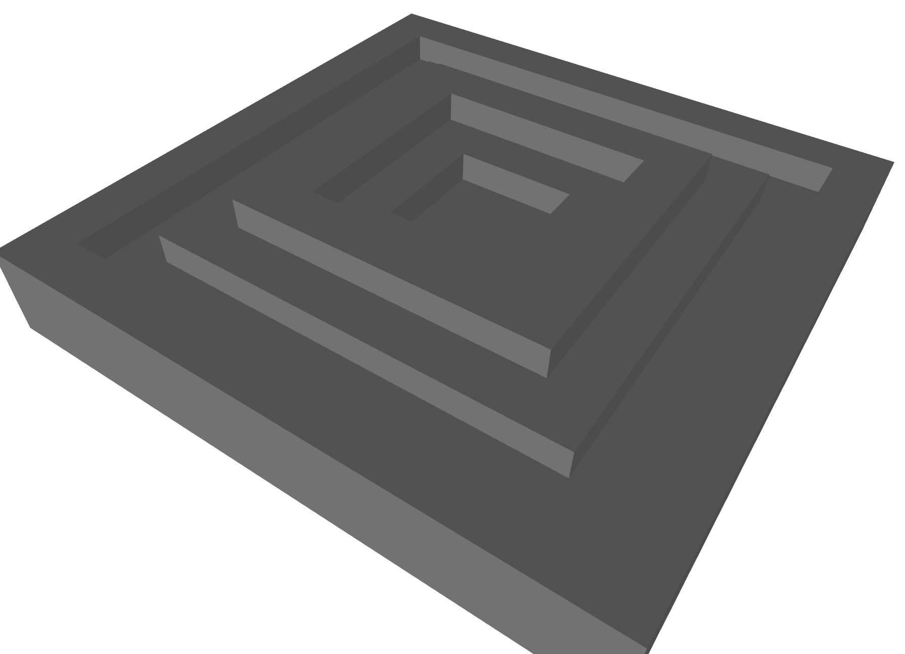
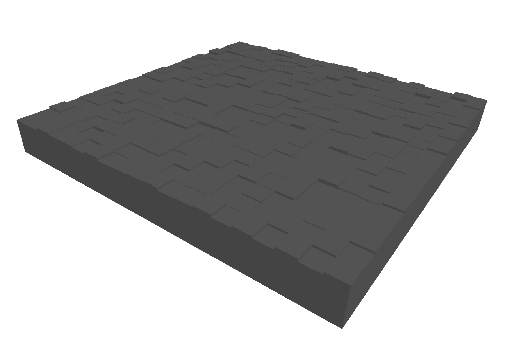
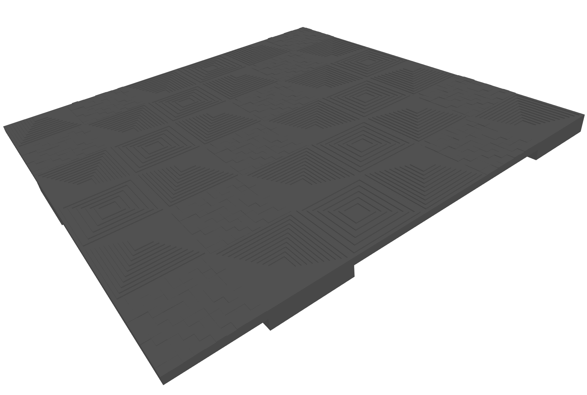

# trimesh-terrain-generator

## description

Pyramid shape based terrain generation.

- minimize Terrain vertex count
- without grid based xyz sampling

## sample

### Simple Pyramid

### Custom height Pyramid

### Cell Field

### Combined Terrain

